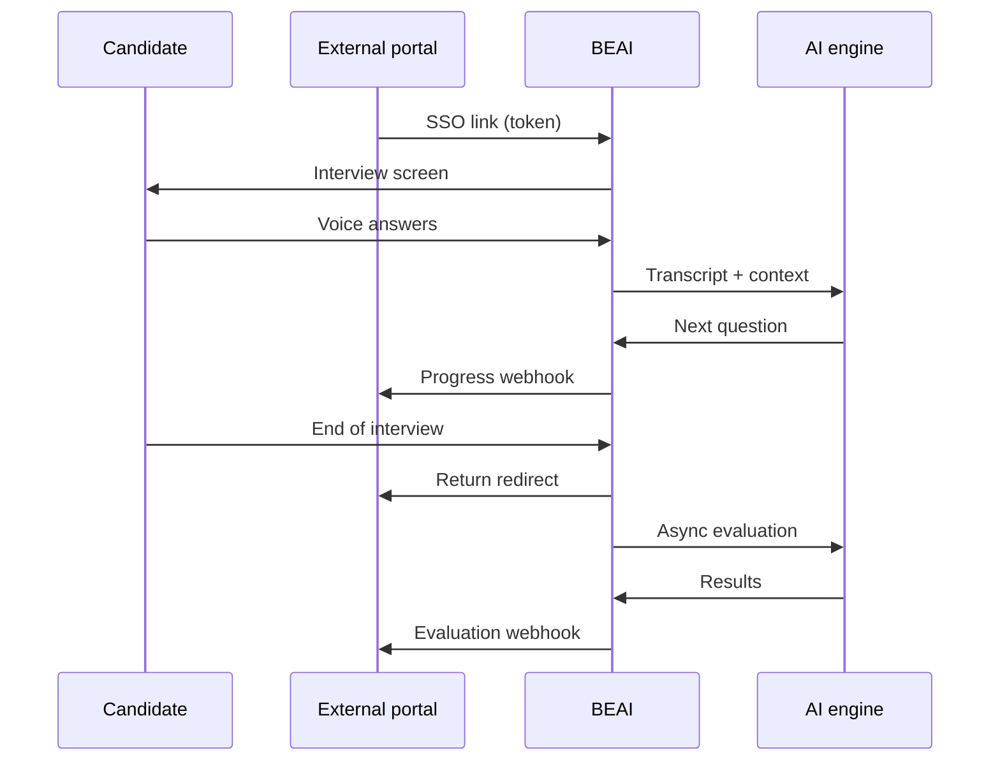

# User flows

## Candidate flow — the full interview

### 1. Ingress

The candidate arrives from an external system (HR portal, LMS, email) through a **secure link** that identifies:
- the candidate (opaque identifier);
- the project / campaign;
- the organizational role;
- the language.

If the candidate does not yet exist in the system, they are **created on the fly** on first access.

### 2. Preparation

- Microphone permission request;
- Audio device selection;
- Any welcome messages / tips (see `03-ux-reference/01-in-app-messages.md`).

### 3. Interview start

The system loads:
- the role profile;
- the competencies to assess (according to the project configuration);
- the first question, read out with a streaming synthetic voice.

### 4. Adaptive conversation

For every candidate answer:
1. Speech transcription → text;
2. AI analysis of the answer;
3. Decision:
   - **Probe deeper** — a follow-up question on the same competency;
   - **Move on** — proceed to the next competency.

During this loop the system may send **progress notifications** to the outside.

### 5. Pauses and support

- **Automatic pauses** between competencies (configurable: every N competencies);
- **Voice nudges** when an answer is too short, to encourage elaboration.

### 6. Closing

- End of the interview;
- Start of the asynchronous evaluation job;
- Redirect to the configured return URL (the calling system).

### 7. Evaluation (asynchronous)

- Analysis of the full transcript against the BARS scales;
- Production of per-competency scores;
- Notification of the result to the external system;
- Availability in the admin panel.

**Expected timing:** a few minutes from the end of the interview.

---

## Administrator flow

### Initial setup

1. Create a **Company** (customer tenant);
2. Create a **Project** with role, competencies, language, UX options, assessment type;
3. Create **Candidates** or enable ingress through external SSO.

### Monitoring

- Candidate status view: pending → in progress → under evaluation → completed (or error);
- Download of transcripts and evaluations;
- Link regeneration for candidates who need fresh access.

### After the evaluation

- Consulting the per-competency report;
- Data export;
- Retry handling (when an evaluation is in the "to be completed" state — see the business rules).

---

## External integration flow (high level)

```
Calling system                       BEAI                          Calling system
      │                                │                                │
      │── generate SSO link ──────────►│                                │
      │                                │── candidate takes interview ──►│
      │◄── progress webhook ───────────│                                │
      │                                │── end-of-test redirect ───────►│
      │◄── evaluation webhook ─────────│                                │
```

Abstract detail of the integrations: the `04-integration-surface/` folder.

---

## Summary diagram


